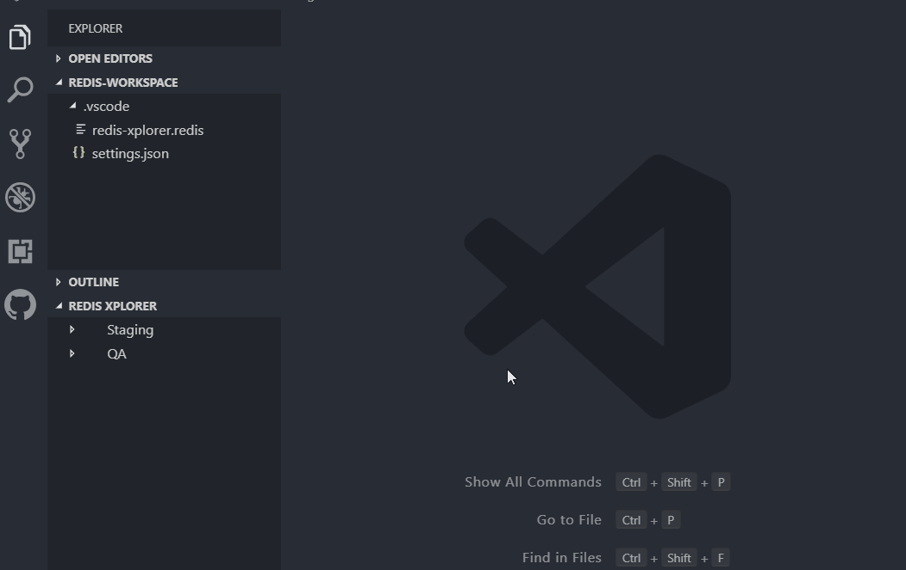
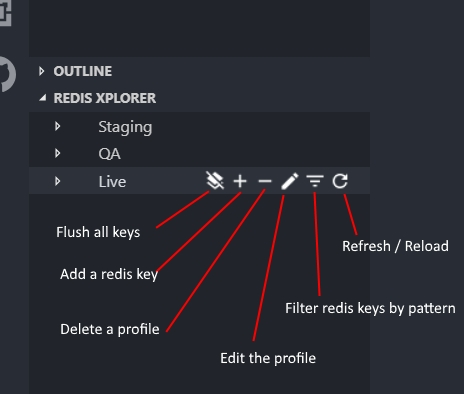

# Redis Xplorer

Redis Xplorer is a Visual Studio Code extension that allows you to

- Create/Edit/Delete multiple redis connection profile

- See redis server connection inforamtion

- Read, edit and save redis cache items

- Filter & focus on required cache items using text pattern e.g., `example*`.

## Setup a new connection profile

1. Select `Redis Xplorer : Add new redis server connection profile` from the command palette.

2. Provide a name for the connection profile.

3. Provide a host server name for the connection

4. Provide an access key for authentication.

5. On completion, this new redis connection will be added to the Redis Xplorer dock window.

## Action available on connection profile

1. Add a new redis item under selected profile

2. Edit the connection profile

3. Delete the selected profile

4. Filter redis keys using pattern

5. Flush / delete all redis keys under a profile

6. Refresh or reload all keys

## Action available on redis item

1. On selecting a redis item, the value is loaded in the text pane. The contents can be edited and saved using `save (ctrl + s)` command

2. Individual redis item can be deleted by clicking on the trash icon that appears while hovering on item.

## Found a bug or have a suggestion

In case, you have a suggestion or feature request. Kindly raise it as an issue [over here](https://github.com/davidsekar/Redis-Xplorer/issues).
